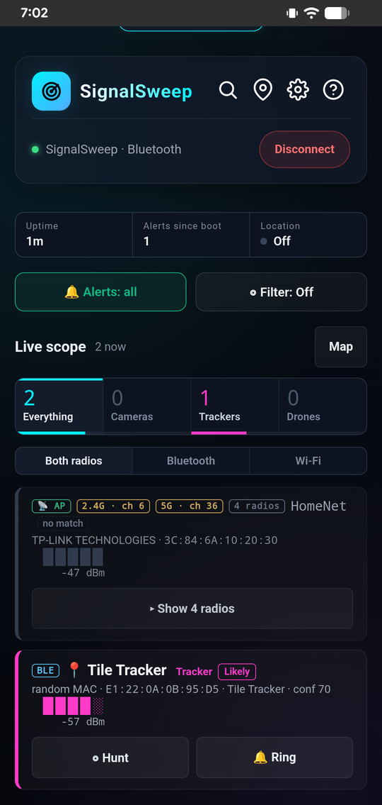
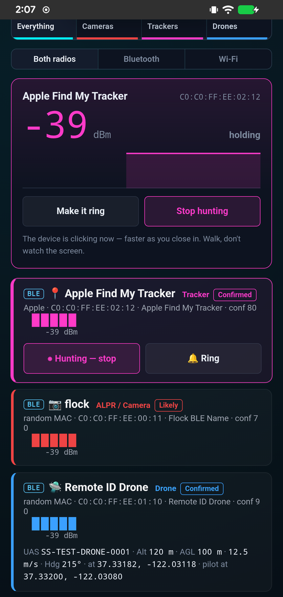
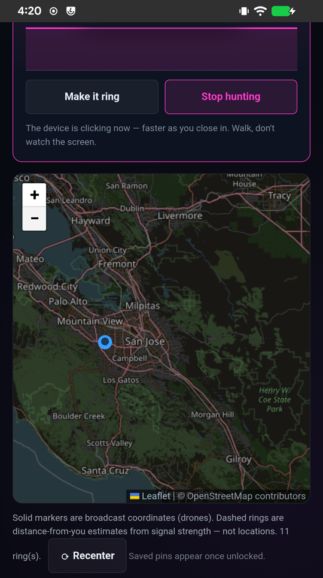

# SignalSweep

A headless RF detector on a $15 ESP32-S3. It scans Bluetooth LE and Wi-Fi
continuously, matches what it hears against a signature list of surveillance
hardware, and **tells you what is nearby by ear** — a different buzzer pattern
per category, no screen required.

- 📷 **ALPR / camera** — two long beeps
- 🎥 **Body cam** — long, short, short
- 🛸 **Drone (Remote ID)** — rising trill
- 📍 **Tracker (AirTag/Tile)** — fast ticking

The phone app is optional. It is a live scope, not a logbook.

| `live` | `hunt <mac>` | `map` |
|---|---|---|
|  |  |  |
| Live matches, strongest first. Cleared when you disconnect. | One target. The beeps speed up as you close in. Walk, don't watch the screen. | Full ASTM F3411 decode: aircraft position and operator position. |

*Bench rig: a second $15 board faking a drone, a Flock camera and an AirTag, so
there's a known signal to check against.*

---

## What it does

- **Runs headless.** USB power bank in a bag, or wired into a car. It scans and
  beeps on its own, with nothing connected.
- **Remembers everything.** Buzzer mute, muted categories, hunt target, filter
  state, BLE name and signature rules all survive a power cycle — because
  unplugging it is the normal way to use it.
- **Goes quiet.** Receive-only stops the device advertising itself, so it is not
  announcing `SignalSweep` to every scanner in range — including the hardware it
  is looking for. It keeps scanning, matching and beeping while quiet.
- **Mutes by category.** Every AirTag in traffic tripping the tracker pattern is
  the detector working correctly and still not worth listening to. Mute that one
  word; the rest keep sounding, and the app keeps showing what the buzzer skipped.
  Picking the Cameras, Trackers or Drones tab does the same in one tap.
- **Lights, if you want them.** Each category has its own LED animation, and the
  bar can be off, one LED, dim or full, so it does not light up a dark car.
- **Names what it hears.** Vendor names come from offline IEEE and Bluetooth SIG
  tables (no MAC ever leaves the phone), and Wi-Fi rows say access point or
  client.
- **Foxhunts.** Point it at one MAC and walk the signal down by ear, or make a
  Find My tracker ring so you can hear where it is hidden.
- **Decodes drone Remote ID in full** (ASTM F3411 / OpenDroneID) over BLE,
  Wi-Fi beacons and Wi-Fi NAN — ID, position, altitude, heading and the
  operator's location, usually before you can hear the aircraft.
- **Takes your own rules.** Signatures are a JSON file on the device, editable
  from the app — match on OUI, company ID, device name, service UUID or SSID.
  No recompile.
- **Bluetooth or USB-C.** Plug it into an Android phone and the phone powers it,
  reads it over the cable, and can shut the Bluetooth radio down entirely.

## What it will not do

No jamming, no deauth, no packet injection, no advertisement spoofing, no
arbitrary GATT writes. It is a receiver. Ringing a tracker is one fixed
Immediate Alert write with a MAC as its only parameter.

No cloud, no telemetry, no accounts, and no history: the app shows what is in
range right now and clears it on disconnect. The one thing it can persist is
location pins you confirm per device, stored only as AES-GCM ciphertext behind a
PIN. Recording defaults to off, and detecting never asks for the PIN.

Receiving radio is legal in most places; transmitting generally is not, and this
device does not — beyond a Bluetooth advertisement you can switch off. Your
local law is not everyone's. Go and read it.

---

## Getting started

You need a [Seeed Studio XIAO ESP32-S3](https://www.seeedstudio.com/XIAO-ESP32S3-p-5627.html)
(~$15) and a USB-C cable.

**Web flasher (no install).** Open
[b0z0dcl0wn.github.io/SignalSweep](https://b0z0dcl0wn.github.io/SignalSweep/) in
Chrome or Edge, plug the board in, click **Connect & flash**. The web app lives
at `/app/` on the same site and talks to the board over Bluetooth.

**Android APK + firmware, from a script.**

```bash
pip install esptool pyserial
python install.py
```

Flashes the board and sideloads the APK over `adb`. It lists your devices and
makes you type the target's name back before it writes anything. See
`install.py --help` for `--apk-only`, `--esp-only` and `--erase`.

## Hardware and controls

The bare board works. Add a **passive buzzer** and a **WS2812 LED bar** for
physical alerts — parts list and wiring in the
**[Wiring Guide](firmware/WIRING.md)**.

| BOOT button | What it does |
|---|---|
| **Quick tap** | If the device went quiet, advertise for two minutes so the app can connect, then go quiet again. |
| **Hold 5 s** | Factory reset: wipes settings and signatures, then reboots. Release early to abort. |

## Contributing

SignalSweep is only as good as its signature list. Found a new tracker, body cam
or ALPR? Send a PR — see [CONTRIBUTING.md](CONTRIBUTING.md).

Full documentation — threat model, serial protocol, build-from-source and the
design record — is in **[docs/README-full.md](docs/README-full.md)** and
[CHANGELOG.md](CHANGELOG.md).

## Credits

- **[Colonel Panic](https://colonelpanic.tech)** — the
  [OUI Spy Unified Blue](https://github.com/colonelpanichacks/oui-spy-unified-blue)
  concept this hardware approach came from.
- **[OrdoOuroborous / @NitekryDPaul](https://github.com/nitekry)** — the Flock
  Safety OUI research the camera detection runs on.

Everyone else is in [CREDITS.md](CREDITS.md).

GPL-3.0-or-later — see [LICENSE](LICENSE). Some vendored components are Apache-2.0.
