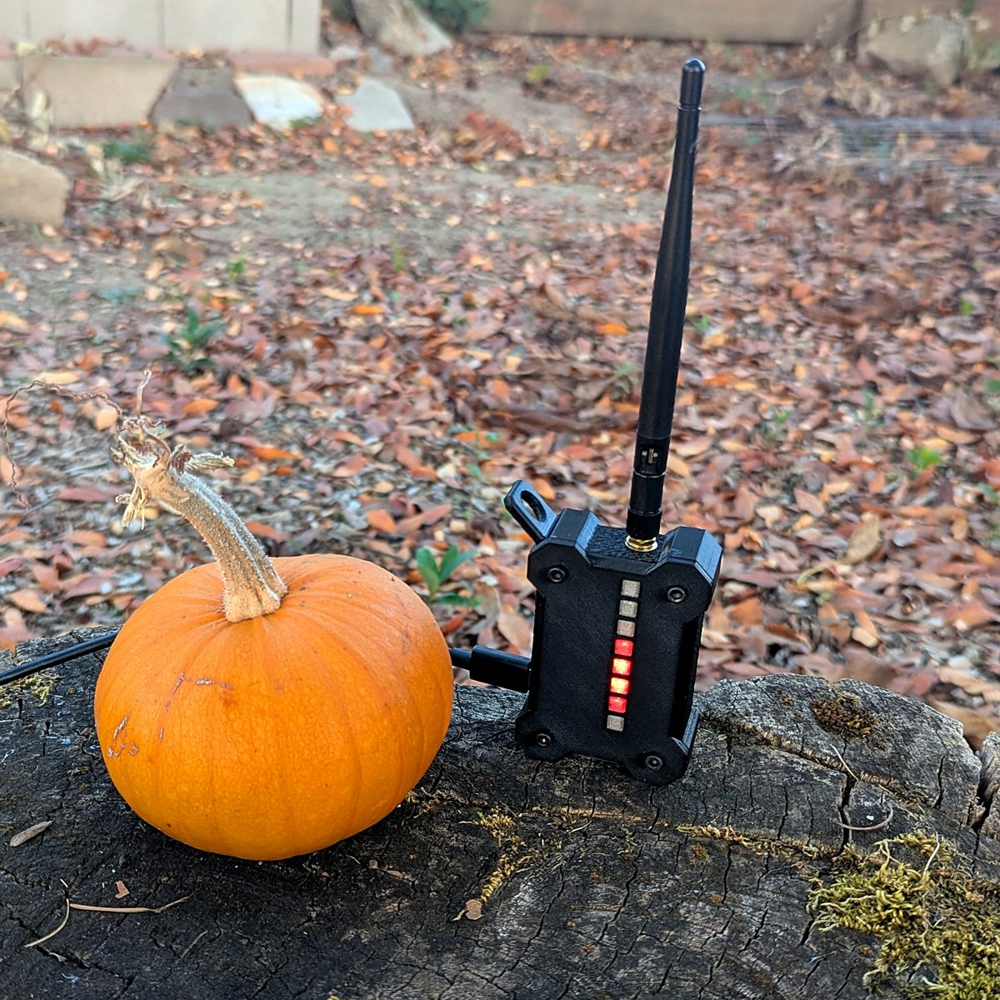
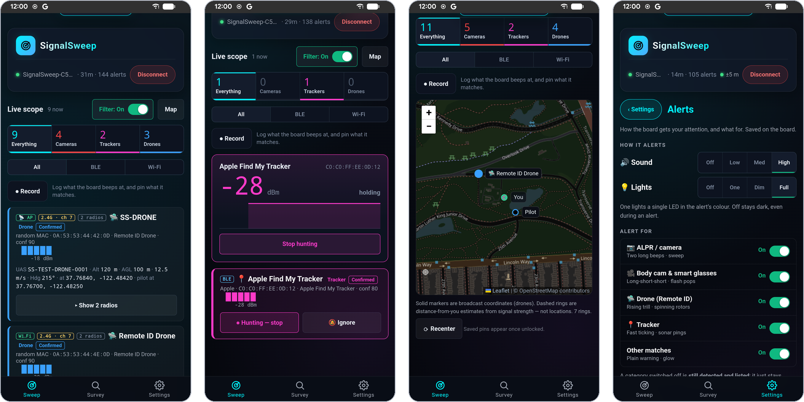

<h1 align="center">SignalSweep</h1>

<p align="center">
  <strong>It beeps at the gear that's watching you.</strong><br>
  A pocket counter-surveillance scanner for cameras, body cams, drones, trackers and attack gear.<br>
  It tells you what's near by sound alone. No screen needed, no cloud, nothing to sign up for.
</p>

<p align="center">
  <a href="https://github.com/B0z0dcl0wn/SignalSweep/releases/latest"></a>
  <a href="https://b0z0dcl0wn.github.io/SignalSweep/"></a>
  <a href="LICENSE"></a>
</p>

<p align="center">
  
</p>

---

## Get one

|  | **SignalSweep** | **SignalSweep Kit** | **Build your own** |
|---|---|---|---|
| **What** | Assembled, flashed and tested, in a 3D-printed case. Plug in USB and go. | Every part plus the printed case. You put it together. | Bring a bare XIAO ESP32-C5 (about $13). Flash it from your browser. |
| **Inside** | XIAO ESP32-C5, dual-band external antenna, buzzer, LED bar, microSD reader | Same parts, loose | Just the board. Add parts as you go |
| **Status** | Coming soon | Coming soon | **[Available now](#build-your-own)** |

Want one when they're ready? **Watch → Custom → Releases** on this repo and you'll hear first.

## Getting started

### The fast way: flash it from your browser

<p align="center">
  <a href="https://b0z0dcl0wn.github.io/SignalSweep/"></a>
</p>

Chrome or Edge, a USB-C cable, one button. It works out which board is
plugged in (C5 or S3) and flashes the matching image. The app runs on the same
site at [`/app/`](https://b0z0dcl0wn.github.io/SignalSweep/app/) and talks to the
board over Bluetooth, so a laptop needs nothing but the browser.

### The script: board and Android phone

```bash
git clone https://github.com/B0z0dcl0wn/SignalSweep.git
cd SignalSweep
pip install -U esptool pyserial

python install.py              # flash the board and install the app on the phone
python install.py --esp-only   # just the board
python install.py --apk-only   # just the phone
```

It downloads the latest release, checks every file's hash, asks which device if
more than one is plugged in, and makes you type the target's name back before
it writes a byte. The phone needs `adb` and USB debugging on. `--erase` wipes the board's saved settings
first, and `--help` has the rest.

## Hear it, don't read it

Every threat category has its own sound and its own light pattern, so the
device works face-down in a cupholder, a backpack or a jacket pocket.

| You hear | It means |
|---|---|
| 📷 Two long beeps | ALPR or camera |
| 🎥 Long, short, short | Body cam or smart glasses |
| 🛸 Rising trill | Drone broadcasting Remote ID |
| 📍 Fast ticking | Tracker: AirTag, Tile, SmartTag |

Mute any category you don't care about. It's still detected and listed, just quiet.

## What it does

**Detects**
- **Drones, in full.** ASTM F3411 Remote ID over Bluetooth, Wi-Fi beacons and Wi-Fi NAN: ID, altitude, speed, heading, and where the pilot is standing. Often before you hear the props.
- **Trackers.** Apple Find My, Google, Samsung and Tile. And when someone floods the area with fake ones, it gives a handful of beeps, then one row that says what's going on, and goes quiet. A real tag still in range sounds once the storm passes.
- **Surveillance hardware.** Flock Safety gear when it's talking, Axon body cams, smart glasses, and anything else on a signature list you can edit from the app: OUI, company ID, name, service UUID or SSID. No recompile.
- **Attack gear** (opt-in). BLE popup spam, deauth bursts, Pineapple-style karma, Flipper Zero hints, and pwnagotchis by name.

**Built for the field**
- **Runs headless.** Battery bank, car USB port, or a phone on a cable. It scans and beeps with nothing connected.
- **Survives the plug-pull.** Mute, categories, hunt target, filter, name and rules all come back after a power cut. Yanking the cable is how you're supposed to use it.
- **Hunts by ear.** Lock one device and walk it down. The beeps speed up as you close in. Keyfob tags that advertise an alert service can be made to ring; the button only appears on those. (AirTags can't be rung by anything but their owner's phone.)
- **Both bands.** The C5 sweeps 2.4 and 5 GHz Wi-Fi, where a growing share of cameras and access points live.
- **Logs if you ask.** What it beeped at and when, on its own flash or the SD card, for a drive with no phone along. Off by default. Never where.
- **Lights on your terms.** Off, one LED, dim or full, plus five themes, so a parked car doesn't glow like a beacon.

**Private by design**
- **Keeps its mouth shut.** Receive-only stops its Bluetooth advertising, so it isn't announcing itself to the gear it's hunting. It keeps listening and beeping.
- **No trail.** The app shows what's here right now and forgets it when you disconnect. Vendor names are looked up offline; no MAC ever leaves your phone.
- **Pins only when you say yes.** One device at a time, AES-GCM encrypted behind a PIN. Off by default, and detection never asks for the PIN.

## The app

<p align="center">
  
</p>
<p align="center"><sub>Live scope · Hunt by ear · Drone + pilot · A sound per threat</sub></p>

## The full build

| Part | What you get |
|---|---|
| **Board** | Seeed Studio XIAO ESP32-C5 |
| **Radios** | Bluetooth LE + dual-band Wi-Fi (2.4 and 5 GHz), swept together, nonstop |
| **Antenna** | External dual-band, U.FL |
| **Alerts** | Passive buzzer (four patterns, three volumes) and an addressable LED bar |
| **Storage** | microSD for session logs and packet captures, plus an alert log on the board itself |
| **Power** | USB-C: a phone, a car port or any battery bank |
| **App** | Android (APK), or Chrome / Edge on a desktop |
| **Firmware** | Open source, GPL-3.0. Flashed and updated from a browser tab |

## What it won't do

> The only winning move is not to transmit.

No jamming. No deauth. No packet injection. No advert spoofing. No arbitrary
GATT writes. It's a receiver. Ringing a tracker is one fixed Immediate Alert
write, and its only parameter is a MAC.

No cloud, no telemetry, no accounts. The app keeps no history: what's in range
shows up, and it's wiped when you disconnect. The board logs what it beeped at
only if you switch that on, and never where. The one location anything keeps is
a pin you say yes to.

Listening to radio is legal in most places. Transmitting usually isn't, and this
barely does: a Bluetooth advert you can switch off, the scan requests that ask
nearby devices for their names, and the one write when you press Ring. Your
local law isn't everyone's. Go and read it.

---

## Build your own

### The shopping list

| Board | Hears | Price | How you flash it |
|---|---|---|---|
| Seeed Studio XIAO ESP32-C5 | 2.4 **and** 5 GHz | ~$13 | Web flasher, `install.py`, or source |
| [Seeed Studio XIAO ESP32-S3](https://www.seeedstudio.com/XIAO-ESP32S3-p-5627.html) | 2.4 GHz | ~$15 | Web flasher, `install.py`, or source |

Plus a USB-C cable. Both boards run the same detector and the same app; the C5
also sweeps the 5 GHz band, where a growing share of cameras and access points
live, and it can be told to watch one band or both.

Optional, and worth it: a **passive buzzer** and a **WS2812 LED bar** (it beeps
and blinks without them only if something else is listening). On the C5, use a
**dual-band U.FL antenna** so it hears 5 GHz as well as 2.4.
The C5 ships tuned to US Wi-Fi channels; elsewhere it still works, it just
skips channels 12–13.

Then flash it the same way as everyone else: see [Getting started](#getting-started).

## Getting your data off

The SD card stays in the case. Pull it over the cable instead: plug in, open the
[data pull page](https://b0z0dcl0wn.github.io/SignalSweep/pull.html), hit
**Export**, pick a folder. You get `alerts.txt` (what it beeped at, readable),
`report.html` (the same, sortable), a `.pcap` per capture for Wireshark, and the
untouched originals in `raw/`. The page is one file, and its security policy
blocks all network access, so nothing leaves your machine. Don't trust hosted
pages? Same folder, no browser:

```bash
pip install pyserial
python pull.py              # same export into ./SignalSweep-<time>/
python pull.py --wipe       # then delete what copied intact (asks first)
python pull.py --phone      # also grab the app's files off the phone over adb
```

## Hardware and controls

The bare board works. A **passive buzzer**, a **WS2812 LED bar**, and an
optional **DS3231 clock** (so the alert log keeps real dates across power
cuts with no phone around) are all add-ons — none of them required. Add a
**microSD card** and you get a richer session log (names, SSIDs, channels) and
captures started from the app over Bluetooth, no cable needed. Parts, pads
and pictures are in the **[Wiring Guide](firmware/WIRING.md)** and the
illustrated `firmware/wiring-diagram.html` / `wiring-diagram-c5.html` pages.

| BOOT button | What it does |
|---|---|
| **Quick tap** | Gone quiet? Advertises for two minutes so the app can connect, then goes dark again. |
| **Hold 5 s** | Factory reset: settings and signatures wiped, then a reboot. Let go early to abort. |

## Contributing

SignalSweep is only as good as its signature list. Spotted a tracker, body cam
or ALPR it misses? Send a PR. See [CONTRIBUTING.md](CONTRIBUTING.md).

The deep end (threat model, serial protocol, building from source, and why
everything is the way it is) lives in
**[docs/README-full.md](docs/README-full.md)** and [CHANGELOG.md](CHANGELOG.md).

## Credits

- **[Colonel Panic](https://colonelpanic.tech)**: the
  [OUI Spy Unified Blue](https://github.com/colonelpanichacks/oui-spy-unified-blue)
  concept this hardware approach came from.
- **[OrdoOuroborous / @NitekryDPaul](https://github.com/nitekry)**: the Flock
  Safety OUI research the camera detection runs on.

Everyone else is in [CREDITS.md](CREDITS.md).

GPL-3.0-or-later. See [LICENSE](LICENSE). Some vendored components are Apache-2.0.

*Hack the planet.*
